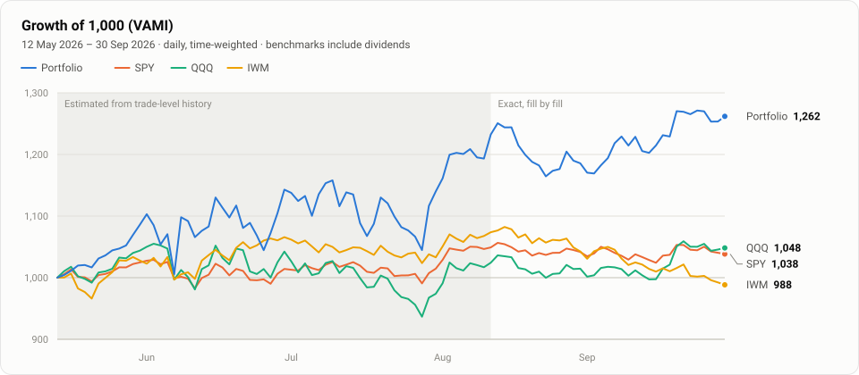
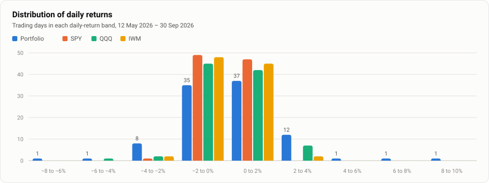

# Kai Ye

Finance and computer science · London · building AI projects that track where we are in the cycle

[About me](#about-me) · [AI projects](#ai-projects) · [Trading journal](#trading-journal)

## About me

Hi, I'm Kai. My background is in finance and computer science (BEng Computer Science, Imperial College London), and I spend a lot of my time talking to great people in all kinds of roles across tech.

I build AI projects to test my understanding of the market. They break down the underlying datasets and track them on an ongoing basis, so that anyone can see where we are in the cycle.

On a side note, the bottom of this page has a little trading journal I keep to validate my understanding.

## AI projects

<!--
  Every project follows the same structure, newest first, and every project shows a chart
  snapshot of its output:

  ### Project name (year)

  One or two sentences: what it tracks and what it says about where we are in the cycle.

  [Live output](https://…) · [Code](https://github.com/KKKKKKAI/…)

  

  CHART-URL is either a chart image the project publishes itself (it stays current), or a
  PNG/SVG saved under assets/projects/, which is published together with this README
  (src="assets/projects/<name>.png").
-->

### NeoCloud CapEx Tracker (2026)

An always-on pipeline that pulls hyperscaler and neocloud filings from SEC EDGAR and HKEXnews, extracts AI capex and cloud revenue with LLMs, and cites every number back to the exact filing line. A human-in-the-loop review loop turns reviewer notes into rules for future extractions.

[Live dashboard on AWS](https://d1pdb32k3hz8st.cloudfront.net/) · [Latest workbook](https://d1pdb32k3hz8st.cloudfront.net/download/latest.xlsx) · [Code](https://github.com/KKKKKKAI/neocloud-capex-tracker)

More projects coming soon.

## Trading journal

Paper trading on TradingView: simulated, not real money.

<!-- PORTFOLIO:START -->
<picture>
  <source media="(prefers-color-scheme: dark)" srcset="portfolio/charts/vami-dark.svg">
  
</picture>

Details: returns, risk measures and trading statistics

| Time-weighted return | Ending balance | Max drawdown | Sharpe ratio | Beta vs SPY |
|---:|---:|---:|---:|---:|
| **+26.2%** | **$126,183** | −9.8% | 1.83 | 1.71 |

**Risk measures** · 12 May 2026 – 30 Sep 2026 · daily, time-weighted · benchmarks include dividends · risk-free rate is the 13-week T-bill

|  | Portfolio | SPY | QQQ | IWM |
|---|---:|---:|---:|---:|
| Ending VAMI | 1,262 | 1,038 | 1,048 | 988 |
| Total return | +26.2% | +3.8% | +4.8% | −1.2% |
| Max drawdown | −9.8% | −4.5% | −11.2% | −8.7% |
| Peak to valley | 10 Jul – 29 Jul | 2 Jun – 10 Jun | 2 Jun – 29 Jul | 14 Aug – 30 Sep |
| Recovery | 3 trading days | 36 trading days | 38 trading days | Ongoing |
| Sharpe ratio | 1.83 | 0.54 | 0.49 | −0.33 |
| Sortino ratio | 3.11 | 0.81 | 0.73 | −0.48 |
| Standard deviation (daily) | 2.15% | 0.79% | 1.42% | 1.03% |
| Downside deviation (daily) | 1.26% | 0.53% | 0.96% | 0.72% |
| Mean return (daily) | +0.26% | +0.04% | +0.06% | −0.01% |
| Positive days | 52 (54%) | 47 (48%) | 49 (51%) | 47 (48%) |
| Negative days | 45 (46%) | 50 (52%) | 48 (49%) | 50 (52%) |

| Portfolio vs. | SPY | QQQ | IWM |
|---|---:|---:|---:|
| Correlation | 0.63 | 0.72 | 0.47 |
| Beta | 1.71 | 1.09 | 0.99 |

<picture>
  <source media="(prefers-color-scheme: dark)" srcset="portfolio/charts/distribution-dark.svg">
  
</picture>

Table view: daily returns by band

| Daily return | Portfolio | SPY | QQQ | IWM |
|---|---:|---:|---:|---:|
| −8 to −6% | 1 | 0 | 0 | 0 |
| −6 to −4% | 1 | 0 | 1 | 0 |
| −4 to −2% | 8 | 1 | 2 | 2 |
| −2 to 0% | 35 | 49 | 45 | 48 |
| 0 to 2% | 37 | 47 | 42 | 45 |
| 2 to 4% | 12 | 0 | 7 | 2 |
| 4 to 6% | 1 | 0 | 0 | 0 |
| 6 to 8% | 1 | 0 | 0 | 0 |
| 8 to 10% | 1 | 0 | 0 | 0 |

**Monthly returns**

| Month | Portfolio | SPY | QQQ | IWM | Ending balance |
|---|---:|---:|---:|---:|---:|
| May 2026 (from 13 May) | +8.6% | +2.5% | +4.4% | +2.8% | $108,599 |
| Jun 2026 | +5.2% | −1.0% | −0.1% | +3.7% | $114,289 |
| Jul 2026 | −0.3% | 0.0% | −6.6% | −3.1% | $113,998 |
| Aug 2026 | +4.0% | +2.7% | +4.2% | +0.9% | $118,564 |
| Sep 2026 | +6.4% | −0.3% | +3.3% | −5.2% | $126,183 |

**Trading statistics** · closed trades

| Trades | Win rate | Profit factor | Average win | Average loss | Expectancy |
|---:|---:|---:|---:|---:|---:|
| 77 | 65% | 4.53 | +8.2% (+$775) | −4.0% (−$317) | +$392 |

Built by a plain-Python pipeline (no AI) from my TradingView paper-trading exports. Positions are marked at daily closes from Yahoo Finance and converted to USD. From 12 Aug 2026 the NAV is replayed fill by fill and ties to TradingView's balance history. Before that, TradingView only exports merged trades, so the daily path is estimated: each closed trade is replayed at its average entry and exit prices, and positions still open on 12 Aug 2026 are held at that day's size. The return since inception is exact either way.

<!-- PORTFOLIO:END -->
